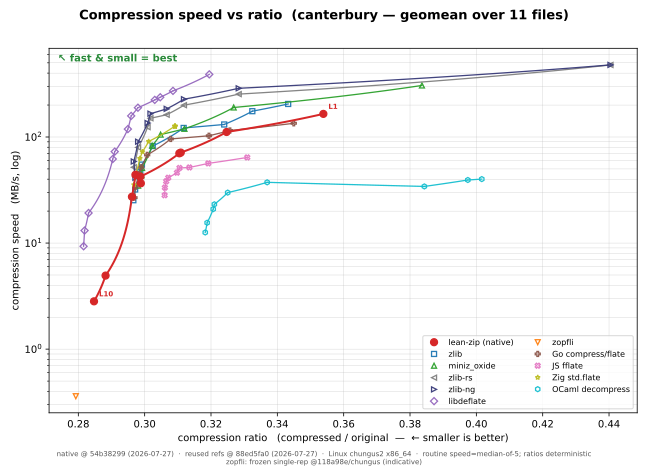
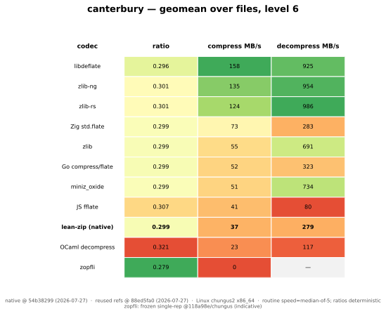
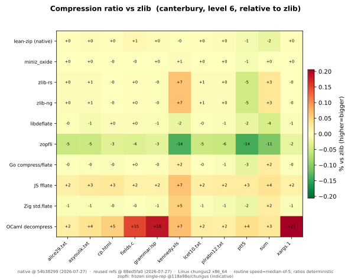
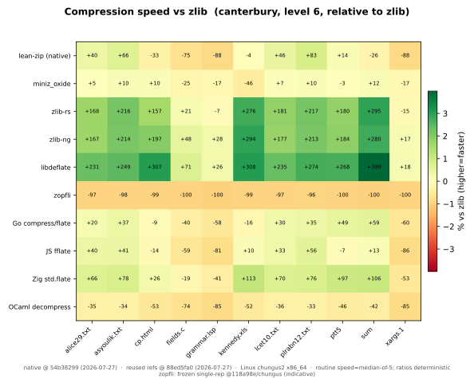
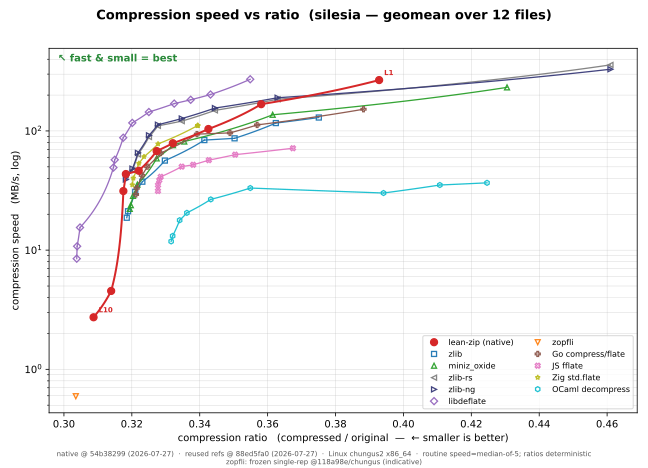
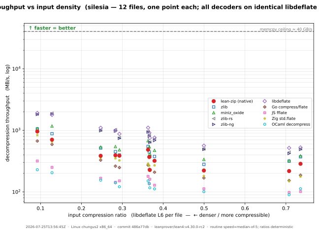
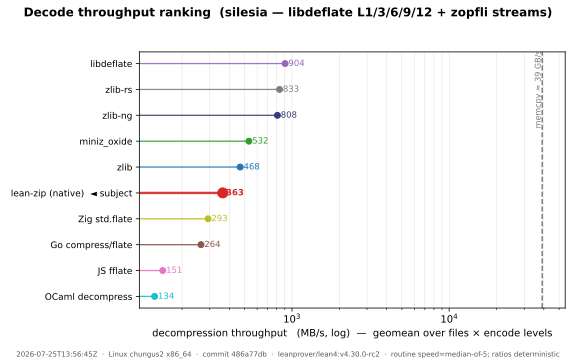
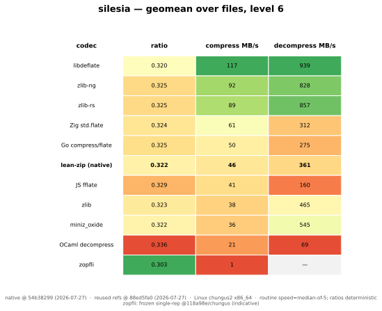
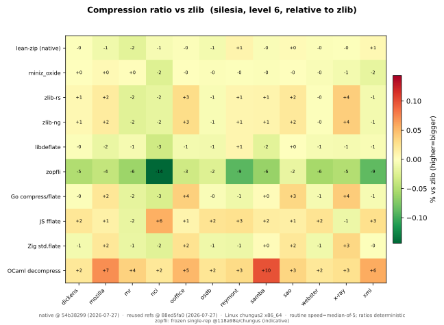
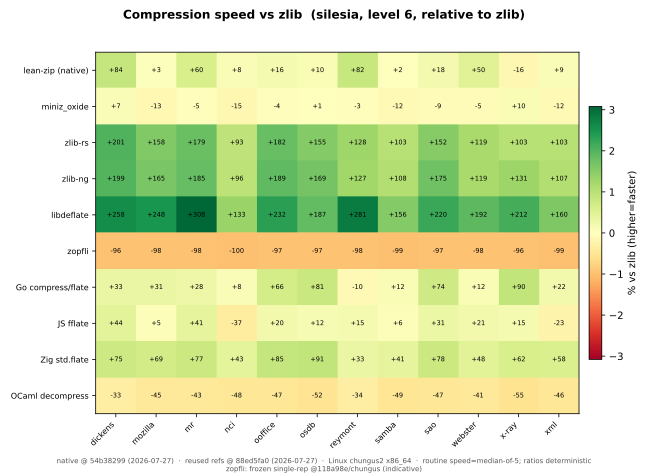

# lean-zip-benchmark

The benchmark dashboard and comparator harness for
[lean-zip](https://github.com/kim-em/lean-zip), the formally verified
DEFLATE implementation in Lean 4. Extracted from that repository's
`bench/` sub-package at its
[`pre-split`](https://github.com/kim-em/lean-zip/tree/pre-split) tag.

> **Frozen dashboard.** The committed graphs and results reflect the final
> dashboard refresh of the optimization campaign (last measurement
> 2026-07-27; frozen at the August 2026 repository split); the
> pareto-history animation replays the pre-split lean-zip git history
> and is kept as a committed artifact. The harness still runs and can
> measure new lean-zip revisions, but the history replay
> (`pareto_history.py`) reads this repository's git log of
> `results/latest.json`, which starts fresh here.

Native lean-zip vs. reference implementations, on **compression ratio** and
**throughput**, over the **real compression corpora** across every DEFLATE
level. The graphs are regenerated from committed data by the workflow below.

> **Real corpora only.** Synthetic patterns were removed (see
> [`plans/track-d-state.md` at the pre-split tag](https://github.com/kim-em/lean-zip/blob/pre-split/plans/track-d-state.md), D-18): the pseudo-prose
> pattern was pathologically compressible (200:1) and its decode read ~3800 MB/s
> versus ~106 MB/s on real prose in the *same* run, so it flattered native on
> every axis. The headline numbers now rest entirely on representative data.

```
run.sh                 # measure, render static SVGs + untracked animation previews
# commit the refreshed JSON and static SVGs
run.sh --history-only  # render animations from this repo's committed history
```

> **Do not regenerate the imported history animations.** The committed
> `graphs/*_compress_pareto_history*.svg` replay the pre-split lean-zip git
> history (48 dashboard refreshes) and cannot be reproduced from this
> repository's fresh history — `run.sh --history-only` here would overwrite
> them with a one-frame animation. They are frozen artifacts; if the harness
> is ever revived, write new history animations under a new filename.

That runs [`lake exe bench-report`](ZipBenchReport.lean) (writes
[`results/latest.json`](results/latest.json) and dumps the exact payloads), then
the standalone external comparators (see below), then [`plot.py`](plot.py) (writes
the static SVGs) and local animation previews. Ratios are deterministic and
every routine throughput row is a **median-of-5**. A full refresh measures one
session; a native-only refresh deliberately reuses earlier reference rows.
Merged documents therefore partition every row into flat exact-key measurement
groups under `meta.row_provenance`, retain both immediate input hashes, and
reject cross-machine splices. Repeated and level-restricted merges trim those
groups without nesting them, so graph footers distinguish complete fresh native
curves from partially reused native rows and preserve the original reference
session. Frozen non-routine overlays retain their own timing and machine label
instead of inheriting the routine protocol. The producer records
`meta.timing_aggregation = "median"` and `meta.timing_reps = 5`; merge and plot
tools reject routine snapshots that do not declare that protocol. Routine
before/after claims must compare two median-of-5 snapshots produced with this
same protocol; exploratory single-shot timings are useful for tuning, but are
not dashboard evidence.

For a long native before/after audit, use [`paired_native.py`](paired_native.py)
instead of running the two revisions as separate sweeps. Its two roots are
lean-zip-benchmark worktrees, each with the lake manifest pinned to the
lean-zip revision under audit and `bench-report` already built. It runs each matching
file/level cell adjacently on one pinned CPU, keeps median-of-5 within each cell,
and checkerboards before-first/after-first order across files and levels. Before
measuring, it asks both binaries for their timing policy and requires exactly
median-of-5. The resumable manifest fingerprints the driver, commits, dirty
source state, binaries, corpus bytes, harness/timing objects, actual Rust miniz
archive, link configuration, CPU affinity, and every core-scheduling session.
Each resumed `coresched new` invocation may have a different private nonzero
cookie; cells record which session measured them. Level lists must be nonempty,
unique, and within 1–10.

The matched link guard covers normalized external flags and byte-identical
benchmark-support inputs. The manifest also records the full normalized linker
response hash for audit, but does not require that full hash to match: an
intended production change may legitimately add a root-local Lean object.

Outputs and the manifest must be distinct paths outside both compared roots, so
creating them cannot change a clean checkout's provenance and break resume. A
canonical Linux invocation is:

```
coresched new -- taskset -c 95 python3 paired_native.py \
  BEFORE_ROOT AFTER_ROOT /tmp/lean-zip-before.json /tmp/lean-zip-after.json \
  --manifest /tmp/lean-zip-paired-manifest.json --require-private-cookie
```

Re-running the same command resumes every fully checkpointed pair. To replace a
known-contaminated pair, add a quoted key such as
`--rerun-cell 'silesia/mozilla|1'`; both sides of that cell are discarded and
remeasured adjacently in the new recorded session.

For review-grade campaigns, commit the finalized manifest under
[`results/archive/`](results/archive/) alongside any focused row archive. The
manifest is the authoritative record of both revisions: a baseline may carry a
fingerprinted benchmark-interface backport while keeping compressor sources at
the named commit, and that dirty state must remain visible rather than being
described as a clean checkout.

(Historical protocol, applicable only if the frozen dashboard is ever
revived under new animation filenames:) commit the JSON and static SVGs,
then render the history animation and commit it separately. Do not amend
the data commit afterward: its SHA, date, and subject are embedded in the
animation frame, so dashboard-refresh PRs merged with a merge commit,
never squash or rebase.

> **Benchmark machine: chungus2 (since 2026-07-05).** The canonical machine moved
> from `chungus` to `chungus2`. The two are indistinguishable on throughput —
> within ~0.3% across every version-stable comparator, and byte-identical on ratio
> — so historical numbers stay directly comparable. `go` and `js` each run on
> their **newest** release (`nix-shell -p go` → go 1.26.3; `nodejs_latest` → node
> v26, ~+22% JS compress over the old default v24), so those two curves track the
> compiler version rather than the machine; js in particular carries large V8
> run-to-run variance and is indicative only. Full analysis:
> [`results/cross-machine-chungus-to-chungus2.md`](results/cross-machine-chungus-to-chungus2.md);
> the last `chungus` snapshot is preserved under
> [`results/archive/`](results/archive/) and the comparison is reproducible via
> [`cross_machine.py`](cross_machine.py).

## Compressors compared

The honest comparison group for a pure-Lean codec is other **language-native**
implementations (no SIMD/asm, or GC'd, or JIT'd) — not just the C + SIMD ceiling.

**C / SIMD references and the ratio ceiling**

| Key | Implementation | Role |
|-----|----------------|------|
| `native` | lean-zip pure-Lean DEFLATE | the thing we are improving; swept **levels 1–10** — levels 3–5 use content-profile routes once the classifier enters its four-region regime, with no upper size cutoff; levels 2, 6, and 9 are fixed points; level 10 is the exact-DP crown (always sweep through 10 so the crown stays on the Pareto) |
| `zlib` | system zlib (FFI) | the ubiquitous baseline |
| `miniz_oxide` | Rust miniz_oxide (FFI) | widely-used Rust reimplementation |
| `zlib_rs` | [zlib-rs](https://github.com/trifectatechfoundation/zlib-rs) via Rust `flate2` | optimized pure-Rust zlib implementation; the comparator enables only flate2's zlib-rs backend and emits raw DEFLATE |
| `zlib_ng` | [zlib-ng](https://github.com/zlib-ng/zlib-ng) via Rust `flate2` | optimized C zlib implementation; built from the same comparator source as zlib-rs so only the backend changes |
| `libdeflate` | libdeflate (FFI) | optimized C + SIMD — the runtime speed bar; swept over its full **levels 1–12** (native caps at 10, the zlib/miniz FFI at 9), so its densest points (10–12) appear on the Pareto |
| `zopfli` | zopfli (FFI) | maximum-ratio ceiling — **frozen** (see below); never in the routine matrix |

**Standalone peers** (each a self-verifying CLI under
[`comparators/`](comparators), built by
[`comparators/build_all.sh`](comparators/build_all.sh), timed with the *same*
methodology as the Lean matrix — median-of-5, `itersFor(size)` iters, throughput
vs uncompressed bytes — and run over byte-identical dumped payloads). zlib-rs
and zlib-ng use the same standalone harness but are listed above because their
zlib/zlib-ng lineage and platform SIMD make them optimized references rather
than peers in the no-SIMD language-native comparison group:

| Key | Implementation | Notes |
|-----|----------------|-------|
| `go` | Go stdlib `compress/flate` | pure Go, the mature language-native standard |
| `js` | [`fflate`](https://github.com/101arrowz/fflate) on Node | pure JS on V8's JIT (not node's C-zlib binding) |
| `zig` | Zig stdlib `std.compress.flate` (0.14.1) | pure Zig; **levels 1–3 not implemented upstream** → mapped to the fastest real level, so L1–L4 coincide. 0.15's encoder is an unimplemented `@panic("TODO")`, hence 0.14.1. |
| `ocaml` | [`decompress`](https://github.com/mirage/decompress) (mirage) | pure OCaml, MirageOS pedigree; slightly different LZ77/Huffman ⇒ a hair worse ratio |

The shared Rust comparator's tracked
[`Cargo.lock`](comparators/rust_codecs/Cargo.lock) currently pins flate2 1.1.9,
zlib-rs 0.6.6, and libz-ng-sys 1.1.29, so dashboard refreshes do not silently
change either backend.

zopfli is the maximum-ratio reference, but it is compress-only, level-less, and
~100× slower than zlib — at default iteration count it dominated the wall-clock
of the whole matrix. So it is **not** part of the routine `bench-report` run.
Instead it is a **frozen artifact**, [`results/zopfli-ceiling.json`](results/zopfli-ceiling.json),
generated once and overlaid on the ratio graphs by [`plot.py`](plot.py):

```
# One-time only — do NOT run on every regeneration (very slow). Re-run solely
# if the corpora themselves change:
lake env .lake/build/bin/bench-report --zopfli-ceiling results/zopfli-ceiling.json
```

Its `ratio`/`out_size` are deterministic (the meaningful signal); its single-rep
`compress_mbps` is an artifact, not a benchmark. Static and full-history graph
footers therefore call out the frozen single-rep Zopfli speed, producer commit,
and machine separately; filtered animations that omit Zopfli omit that label.
A language-native comparator whose toolchain is unavailable is skipped, so the
dashboard degrades gracefully.

## Workloads

The **real compression corpora** from the literature, swept over native levels
1–10 (the level-10 exact crown always included; the zlib/miniz FFI references cap
at 9, `libdeflate` over its full 1–12 — see *Compressors compared*).
Each corpus is a subdirectory of [`corpora/`](corpora); every file in it is one
single-size workload tagged `<corpus>/<file>`, and the harness discovers corpora
by directory (nothing hard-codes Canterbury — a new corpus slots in once its
files land).

- **Canterbury corpus** (11 files, ~2.8 MB: English text, HTML, C and Lisp
  source, an Excel spreadsheet, a fax bitmap, a man page, a SPARC binary),
  committed under [`corpora/canterbury/`](corpora/canterbury) (materialized by
  [`fetch_corpora.sh`](fetch_corpora.sh), verified against recorded SHA-256), so
  CI needs no network.
- **Silesia corpus** (12 files, ~202 MB: prose, UNIX binaries, an HTML
  dictionary, a source tarball, XML, databases, medical images, a DLL) — the
  modern standard zstd/brotli/lzma report against. Fetched on demand into a
  gitignored cache (`fetch_corpora.sh silesia`, pinned GitHub mirror,
  SHA-256-verified); its rows slot into the same per-level charts automatically
  and use the same median-of-5 timing policy as Canterbury. This makes a full
  refresh slower, but prevents one-shot Silesia noise from masquerading as a
  high-level regression.

The level-7 content classifier was selected on Silesia, so its route table is
still an empirical heuristic rather than a general dominance guarantee. The
levels 3–5 reuse begins exactly where that classifier changes from its small
adjacent-run signal to its four-region cardinality sketch (1 MiB); it has no
upper cutoff or per-file byte-length exception. Levels 2, 6, and 9 no longer
use content routing. In particular, level 6 uses one chain-48/depth-6 split
pipeline for both individual files and whole-corpus tar streams.
The public L1 point is an intentional fast-tier retune: relative to its former
point it raises the equal-file-geomean output/input ratio by 7.8% on Canterbury
and 8.7% on Silesia for 52.5% and 64.1% more throughput, respectively.
The fixed public L2 point is the fused c4/i3 fast-tier bridge. Relative to its
former c8/i8 point it spends 3.0% equal-file-geomean ratio on Canterbury and
2.9% on Silesia for 38.6% and 46.4% more throughput, respectively.

The published Pareto uses an equal-file geomean for both ratio and throughput.
The separate [`hull_check.py`](hull_check.py) diagnostic pools bytes and time
over the whole corpus; that weighting is useful for campaign steering, but it
is a different aggregate and its dominance verdicts are not dashboard claims.
Because raw `deflateRaw` defaults to level 6, the fixed L6 point is also the
whole-stream default. Gzip/zlib wrapper defaults are unchanged.

The miniz_oxide comparisons were also repeated in fresh, matched-session
median-of-5 runs. On Silesia's equal-file-geomean aggregate, native L1 directly
beats miniz_oxide L1 at a better ratio: 273.7 vs 235.2 MB/s (+16.4%), with a
ratio of 0.392833 vs 0.430526 from exact output/input sizes (8.8% smaller). The
public L1 implementation measured at `0771f741` is unchanged through this
dashboard refresh; the intervening production edits tune L2. The raw rows are
archived in
[`matched-l1.chungus2.0771f741.json`](results/archive/matched-l1.chungus2.0771f741.json).
In the separate L3/L4 run, native's L3→L4 reciprocal-throughput mix led at the
exact miniz L3 and L4 ratios by 1.18% and 1.28%, respectively (1.14% and 1.21%
using the dashboard's stored rounded ratio fields). This corroborates, but does
not turn the narrow lead into a noise-independent separation; those raw rows
are archived in
[`matched-l34.chungus2.9f855ad9.json`](results/archive/matched-l34.chungus2.9f855ad9.json).

The synthetic `prng` pattern used to be the only incompressible workload; its
replacement is **real** poorly-compressible files in the corpora (Silesia `sao`,
`x-ray`, `ooffice`). A near-1.0-ratio point, if wanted, comes from a real
already-compressed file (a JPEG/PDF) — never synthetic noise.

## Graphs

Each corpus gets a layered, corpus-generic set (a new corpus slots in with no
code change). The **headline is the speed-vs-ratio Pareto scatter**: x = ratio
(← smaller is better), y = speed (MB/s, log), and each codec is markers at its
measured levels joined by the **achievable mixing frontier** between adjacent
levels (see *Reading the Pareto* below), so the whole speed/ratio tradeoff reads
at a glance — top-left (fast *and* small) is best, and a dominated codec sits to
the lower-right. Two complements give precise numbers and per-file detail:

- `<corpus>_compress_pareto.svg` — **headline**: compression speed vs ratio,
  codecs as level-curves (replaces the whole per-level bar set).
- `<corpus>_compress_pareto_history.svg` — the headline chart **animated
  through git history** (`pareto_history.py`, regenerated after the data
  commit by `run.sh --history-only`): the reference curves stay fixed at
  the current data while the native curve replays every committed dashboard
  refresh, one faint trail per level. Self-playing SMIL, so it animates inside
  a README ``. Frames
  that only jitter within throughput noise are dropped, as are stale-branch
  refreshes whose deterministic ratios revert to an already-seen state (see
  the script docstring). `--video` additionally renders an mp4 + GIF (needs
  ffmpeg on PATH), and `--html` an interactive player with a scrubber and
  per-frame commit info; both land in `graphs/` untracked.
- `<corpus>_decode_density.svg` + `<corpus>_decode_ranking.svg` — the
  **decompression analogue** (see *Decoding* below): every decoder timed on
  byte-identical fixed-encoder streams. The density chart is a per-file scatter at
  L6 (x = that file's libdeflate ratio, y = decode MB/s); the ranking chart is the
  precise lollipop ordering, geomean over all encode levels (L1/3/6/9/12) and
  zopfli. Both carry the `memcpy` bandwidth ceiling. Not a Pareto — input density
  is exogenous to the decoder, so the highest band wins.
- `<corpus>_summary.svg` — colour-graded geomean table (ratio / compress /
  decompress per codec, level 6), sorted by speed.
- `<corpus>_ratio_heatmap.svg` / `_compress_heatmap.svg` — per file, relative to
  zlib (red = worse), showing *where* a codec wins or loses without 100 bars.

### Reading the Pareto (the mixing frontier — read this before judging a new tier)

The line between a codec's two adjacent levels is **not** a straight segment. It
is the **mixing curve**: the operating points you can actually reach by
compressing a byte-fraction `f` of the input at the higher level and `1-f` at the
lower one (e.g. per block). That is the real achievable set between two settings
(exact for a single file; the plotted points are per-file geomeans, so between
two geomean dots the curve is a close proxy for the corpus-geomean achievable
set), so it is the honest connector. It joins *adjacent levels* — it is not a
computed global upper envelope, so read it per codec, per neighbouring pair.

The geometry matters, and it is easy to get wrong:

- **Ratio** is additive in bytes, so it is *linear* in `f`.
- **Wall-clock time** is additive, so **1/throughput** is *linear* in `f` —
  throughput itself is not. Throughput is a rate; you average rates by averaging
  their reciprocals (time), never the rates directly.
- Therefore the frontier is a straight line **only** in *(ratio, time-per-byte)*
  space. On the *(ratio, MB/s)* axis it is a curve, and on the **log-MB/s axis
  (what we plot) a straight level-to-level segment sags *above* the true
  frontier** — it overstates the speed reachable at an intermediate ratio. The
  plot draws the correct sagging curve (`_mix_curve` in `plot.py`); trust it, not
  a ruler laid between two dots.

**Consequence for judging incremental progress.** A new operating point is a
genuine improvement — *outside our own frontier* — iff, at its compression ratio,
it is **faster than blending the two bracketing levels** (i.e. it sits *above*
the codec's mixing curve at that ratio). Equivalently: interpolate the two
adjacent levels to the new point's ratio; if that mix is slower, the new point is
a real Pareto gain. Judging "inside/outside" by eye against the straight segment
on the log axis is wrong and will reject real wins — this bit us once (issue
#2638 measurement). To check it numerically, compare in **seconds-per-MiB
(`1/throughput`)**, not MB/s:

    f       = (ratio_lo − ratio_new) / (ratio_lo − ratio_hi)   # 0 at lo … 1 at hi
    t_mix   = (1 − f)/mbps_lo + f/mbps_hi                       # s per MiB of the mix
    outside = (1/mbps_new) < t_mix                              # new point faster at equal ratio

**This is a within-codec test, and it is the bar for "did we make progress".** It
is *not* the same as beating the C+SIMD references. libdeflate and zopfli set the
absolute ratio/speed *ceiling* (the reference band), not the bar for our own
incremental work: a change that pushes a point outside *our* mixing curve is
progress even while the references remain ahead. Do not gate our own Pareto
improvements on catching a SIMD C codec. (Cross-codec comparison still matters —
as context, and for justifying a *new tier's* external reason to exist — it just
is not the pass/fail test for an incremental within-native gain.)

### Canterbury corpus (11 small files, native levels 1–10; libdeflate 1–12)






### Silesia corpus (12 large files, native levels 1–10; libdeflate 1–12)









## Decoding (decode-density)

The compress headline is a *speed-vs-ratio Pareto* because each codec chooses its
own ratio/speed tradeoff. Decompression has no such tradeoff: the input density is
**exogenous** — a property of the stream, not the decoder's choice. So the decode
charts measure **decode throughput vs input density**, with every decoder on
*byte-identical* input (only possible because DEFLATE is one interoperable format
— you genuinely can feed one encoder's stream to every decoder). The fixed encoder
is **libdeflate** (raw DEFLATE, the densest realistic streams); `memcpy` is the
memory-bandwidth ceiling on emitting the output bytes. This is the rigorous way to
isolate a decoder: an own-encoder scatter (the lzbench / Squash convention)
confounds decoder speed with each encoder's ratio.

The native row here is the **known-exact-size production path** — the same one
ZIP extraction runs (`Zip.Archive` decodes each entry at its declared
`uncompressedSize`). The decode-density harness feeds the decoder the stream's
true output size, so native decodes through
`Zip.Native.Inflate.inflateSized … (exact := true)`: the verified branch-free
`uset` exact-size fastloop that writes every byte once into the pre-extended
buffer, dropping the per-literal capacity and output-size checks. It is proven
byte-identical to the push decoder `inflate` (`inflateSized_agrees`), so the
measured throughput is the production fast path, not a benchmark-only shortcut.

Two views over the fixed-encoder streams — libdeflate at levels 1/3/6/9/12 plus a
zopfli stream per file (the densest realistic raw DEFLATE):

- **`<corpus>_decode_density.svg`** — per-file scatter at a single representative
  level (libdeflate L6): x = each file's compression ratio (wide, from ~0.27 text
  to ~0.9 incompressible like `sao` / `x-ray`), y = decode MB/s. Shows
  content-dependence — literal-heavy incompressible data decodes differently than
  match-heavy text.
- **`<corpus>_decode_ranking.svg`** — lollipop of geomean decode MB/s per decoder,
  one number each, the geomean taken over **every** stream (all five libdeflate
  levels and zopfli, each file) so the ranking spans the full input-density range
  rather than one encode level. The memcpy ceiling shows the headroom.

Pipeline (wired into `run.sh` step 3b):

```
# 1. dump the fixed-encoder streams for Silesia (libdeflate L1/3/6/9/12 + zopfli)
#    + time the in-process decoders + memcpy. Streams are cached under the dir
#    below and reused across runs — a stream is (re)encoded only when missing, so
#    the slow zopfli pass is paid once.
lake env .lake/build/bin/bench-report --decode-density \
  results/decode_density.json payloads-deflate
# 2. time the external decoders (zlib-rs / zlib-ng / Go / JS / Zig / OCaml)
#    on the same streams
python3 decode_density.py payloads-deflate results/decode_density.json
# 3. plot.py auto-detects decode_density.json → graphs/<corpus>_decode_{density,ranking}.svg
```

Each comparator gains a `decode <stream.deflate>` mode (alongside its existing
`<payload> <level>` roundtrip mode) so it decodes a provided stream with the same
median-of-5 / `itersFor` methodology as the Lean side. The streams under
`payloads-deflate/` are gitignored and act as a semi-permanent cache
(regenerated only when a stream is missing); `decode_density.json` is committed
alongside `latest.json`.

### Profiling the decoder

`--decode-density` sweeps *all five* decoders over all of Silesia, so a `perf`
of that process is a blur of native + zlib + miniz + libdeflate + memcpy. To
attribute cost to native inflate alone, use the single-decoder driver
[`inflate-profile`](ZipInflateProfile.lean) — its `decode` mode's steady-state
loop calls **only** `Zip.Native.Inflate.inflate` over one payload, so no other
decoder shows up in the profile (the binary links libdeflate for `compress` mode,
but that code never runs in a `decode` pass):

```
# 1. dump one libdeflate raw-DEFLATE payload (levels 1–12; note the origSize it prints)
lake build inflate-profile
lake env .lake/build/bin/inflate-profile \
  compress corpora/silesia/dickens /tmp/dickens.deflate 6
# → "origSize for decode = 10192446" (the decompressed length = the sizeHint)

# 2a. sample the hot loops (call graph). Pick reps so the run is a few seconds.
#     Lean/C is compiled without frame pointers, so use DWARF unwinding for
#     accurate call graphs (`-g` / --call-graph fp gives broken stacks here).
lake env perf record --call-graph dwarf -- \
  .lake/build/bin/inflate-profile decode /tmp/dickens.deflate 10192446 2000
perf report                    # interactive; the hot loop is inflateLoopTreeFree
# annotate a symbol (perf shows mangled names — grep the binary for the real string:
#   nm .lake/build/bin/inflate-profile | grep inflateLoopTreeFree)
lake env perf annotate -- lp_lean_x2dzip_Zip_Native_Inflate_inflateLoopTreeFree

# 2b. hardware counters (IPC, branch + cache behaviour) over the same run
lake env perf stat -e cycles,instructions,branches,branch-misses,\
cache-references,cache-misses -- \
  .lake/build/bin/inflate-profile decode /tmp/dickens.deflate 10192446 2000
```

The driver re-invokes inflate fresh every rep (never binding the result once and
reusing it) and consumes each result through a `noinline` sink, so no decode is
hoisted or dropped — wall-clock scales linearly with `reps`, as it must for
`perf` to accumulate samples in the real hot loops.

**Same-worktree A/B rule (from
[#2630](https://github.com/kim-em/lean-zip/issues/2630) — this bites).** When
comparing a decode change against its baseline, build **both** commits in the
**same** worktree and profile the two saved binaries. A baseline built in a
*separate* worktree is not code-layout-comparable: the two embed different
absolute paths and can link objects into a different layout, shifting i-cache
alignment of the hot loops and producing a uniform ~5–15% offset across the
board — a pure artifact that survives interleaving and masquerades as a real
delta. `git checkout <parent>`, `lake build inflate-profile`, copy the
binary aside; `git checkout` back, rebuild, copy aside; then A/B the two saved
binaries. Untouched code paths must overlay to within ~1%; a uniform offset is
the worktree, not your change.

**Write-once cursor spike (#2799).** `inflate-profile` also has two spike modes,
`decode-fast` (the `set!` cursor `Inflate.inflateFast`) and `decode-fast-u` (the
branch-free `uset` fastloop `Inflate.inflateFastU`), plus `decode-ld` (libdeflate's
own decompressor as the absolute speed bar), all with the same
`<payload> <origSize> <reps>` arguments. They exercise the write-once cursor
decode from `Zip/Native/InflateFast.lean` (exact-size path — `origSize` must be
the true decompressed length), and each asserts its output equals the reference
`Inflate.inflate` once before the timed loop. Every mode now prints absolute
throughput (MB/s over the decompressed bytes, only the loop timed), so a
best-of-5 sweep gives end-to-end decode rates directly. Because all modes live in
one binary, an A/B across `decode` / `decode-fast` / `decode-fast-u` is strictly
more layout-comparable than the two-worktree rule above — no separate builds.
Build with libdeflate enabled (`nix-shell` already lists it) for `compress` /
`decode-ld`: `LIBDEFLATE_LDFLAGS=-ldeflate lake -R build inflate-profile`.
The #2799 verdict from this A/B is recorded in `plans/track-d-state.md` at the pre-split tag.

## What the starting baseline showed

*(Historical: this section describes the **first** dashboard snapshot, before
the optimization campaign — it is the "before" picture that drove the backlog.
The final frozen dashboard above tells the "after" story: on the last refresh,
native Canterbury L6 reaches ratio 0.299 (geomean over 11 files) with ~37 MB/s compress and
~280 MB/s decompress, and the lean-zip README summarizes the endgame
comparisons.)*

> On real data (Canterbury, level 6, geomean over 11 files) native is the
> **worst real codec on all three axes** — ratio 0.323 (zlib 0.299), compress
> 10 MB/s (zlib 55), decompress 92 MB/s (zlib 696) — with the ratio gap
> **largest on big prose** (`plrabn12` +30%, `lcet10` +24% vs zlib). Those two
> findings drove the optimization backlog.

- **Ratio.** Native trails every real codec; the gap is small on
  short/structured files but large on big prose (`plrabn12.txt` 0.525 vs zlib's
  0.405). The language-native peers land within a hair; only OCaml `decompress`
  gives up a little ratio (different LZ77/Huffman). zopfli is the floor (0.279).
- **Compression speed is the gap — but it's a language-native gap, not a chasm.**
  Throughput stratifies by implementation maturity: libdeflate (C+SIMD) on top,
  then the optimized zlib-ng / zlib-rs pair, then Zig / miniz_oxide, then Go /
  zlib, then the JIT'd JS, then OCaml, then `native`. lean-zip is in the pack
  and at the back, but the distance to the *other pure-language* codecs is a
  small single-digit factor, not the order-of-magnitude that the C+SIMD ceiling
  alone suggests.
- **Decompression is behind too on real data** — native ~94 MB/s vs zlib ~692
  (≈7×) on Canterbury, ~100 vs ~365 (≈4×) on Silesia. (The earlier "competitive"
  read came from the synthetic match-heavy text, which decoded as near-pure
  memcpy; real, literal-heavy data exposes the per-symbol Huffman decode path.)

These observations drive the optimization backlog in
[`plans/track-d-state.md` at the pre-split tag](https://github.com/kim-em/lean-zip/blob/pre-split/plans/track-d-state.md).

## Comparator toolchain notes

Platform requirements and opt-in/opt-out controls for the bench
comparators. For the bench CLI itself see [`ZipBench.lean`](ZipBench.lean)
and the `Operations:` listing in its header docstring.

### Comparator matrix

| Comparator   | Phase | Toolchain required                      | Default in `lake build` | Disable knob              |
|--------------|-------|------------------------------------------|--------------------------|---------------------------|
| zlib         | A     | system zlib + headers (`pkg-config`)     | required                 | n/a (load-bearing)        |
| miniz_oxide  | 0c    | `cargo` + `rustc` (Rust ≥ 1.74)          | auto-on if cargo on PATH | `MINIZ_OXIDE_DISABLE=1`   |
| libdeflate   | 0a    | system `libdeflate` (headers+lib)        | auto-on if header found  | `LIBDEFLATE_DISABLE=1`    |
| zopfli       | 0b    | system `zopfli` (headers+lib)            | auto-on if header found  | `ZOPFLI_DISABLE=1`        |

libdeflate and zopfli are plain C libraries linked directly (no Rust shim):
the lakefile auto-probes `<libdeflate.h>` / `<zopfli.h>` with the C compiler
and, when found, compiles the shims with `-DHAVE_LIBDEFLATE` / `-DHAVE_ZOPFLI`
and links `-ldeflate` / `-lzopfli`. When absent, the shims fall back to
`IO.userError` stubs (substrings `"libdeflate: not built with"` /
`"zopfli: not built with"`), so `lake build` still works. Set
`LIBDEFLATE_LDFLAGS` / `ZOPFLI_LDFLAGS` to override the link flags. On NixOS the
libraries come from `pkgs.libdeflate` / `pkgs.zopfli` in `shell.nix`.

### miniz_oxide

**Crate:** `rust/miniz_oxide_shim/` — a `staticlib` Cargo crate that
wraps `miniz_oxide` v0.8 with a tiny C-ABI surface
(`lean_miniz_oxide_compress` / `_decompress` / `_free`). The Lean side
calls into this through [`c/miniz_oxide_ffi.c`](c/miniz_oxide_ffi.c)
and exposes [`Bench/MinizOxide.lean`](Bench/MinizOxide.lean).

**Bench operations:** `compress-miniz` and `inflate-miniz`, e.g.

```
lake exe bench compress-miniz 65536 text 6
hyperfine 'lake exe bench inflate-miniz 1048576 prng 6'
```

#### Build-time auto-detection

`lakefile.lean` detects cargo at configure time:

* If `MINIZ_OXIDE_DISABLE=1` is set, the comparator is skipped.
* If `MINIZ_OXIDE_LDFLAGS` is set, those flags are appended verbatim
  (overrides cargo auto-detection — useful when packaging against a
  pre-built static library).
* Otherwise `cargo --version` is probed; if it succeeds, the lakefile
  shells out to `cargo build --release --manifest-path
  rust/miniz_oxide_shim/Cargo.toml` and links the resulting
  `libminiz_oxide_shim.a`.

When the comparator is disabled the C shim still compiles, but
`MinizOxide.compress` / `MinizOxide.decompress` raise
`IO.userError` containing `"miniz_oxide: not built with Rust support"`
at runtime. The smoke tests in [`BenchTests/MinizOxide.lean`](BenchTests/MinizOxide.lean)
treat that exact substring as a clean skip, so `lake test` keeps
passing on toolchains without Rust.

#### Verified platforms

| Platform                         | Status        | Notes                                                  |
|----------------------------------|---------------|--------------------------------------------------------|
| NixOS (`shell.nix` provisioned)  | verified      | `cargo`+`rustc` come from `pkgs.cargo`, `pkgs.rustc`.  |
| Bench machine `chungus`          | verified      | Same NixOS environment via `nix-shell`.                |
| Linux distros with system Rust   | expected OK   | Any cargo ≥ 1.74; not yet smoke-tested in CI.          |
| macOS                            | expected OK   | Requires `rustup` / homebrew Rust on `PATH`.           |
| Windows                          | not tested    | Should work via MSVC + cargo, but untried.             |

If you build on a platform that should be in this matrix and the
comparator works, please update this table in a follow-up PR.

#### Re-running cargo manually

The lakefile invokes cargo lazily; if you tweak the Rust shim and want
to force a rebuild without rerunning `lake build`:

```
cargo build --release --manifest-path rust/miniz_oxide_shim/Cargo.toml
```

The resulting `.a` lives at
`rust/miniz_oxide_shim/target/release/libminiz_oxide_shim.a` and is the
exact path Lake links from. `lake clean` does **not** purge cargo's
target directory — use `cargo clean --manifest-path …` for that.
